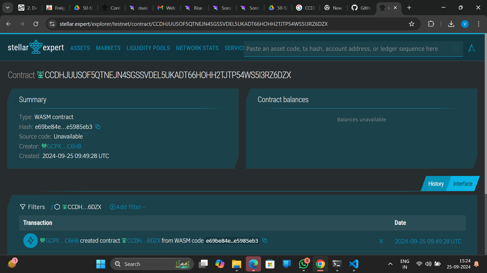

##### Deployed smartcontract address: CCDHJUUSOF5QTNEJN4SGSSVDEL5UKADT66HOHH2TJTP54WS5I3RZ6DZX

# Crypto-based Gift Cards dApp

## Project Title
Crypto-based Gift Cards dApp

## Project Description
The Crypto-based Gift Cards dApp is a decentralized application that allows users to create, buy, and redeem digital gift cards using Lumens (XLM) as the underlying cryptocurrency. The application ensures that the entire process, from issuance to redemption, is managed through smart contracts, guaranteeing a secure, transparent, and efficient system.

## Project Vision
Our vision is to simplify the gift-giving process by introducing a secure and transparent crypto-based solution. With the Crypto-based Gift Cards dApp, users can easily send and receive gift cards while enjoying the benefits of the Stellar blockchain—low fees, fast transactions, and enhanced security. This system also empowers businesses by offering a modern, decentralized gift card solution, reducing fraud and increasing accessibility.

## Key Features
- **Gift Card Creation**: Users can create gift cards by locking a specified amount of Lumens (XLM) into a smart contract.
- **Purchase and Transfer**: Users can purchase gift cards and transfer them to others as gifts, with all transactions recorded on the blockchain.
- **Redemption**: Gift card recipients can redeem their cards by invoking the smart contract, releasing the locked Lumens (XLM) back to their accounts.
- **Security and Transparency**: Smart contracts ensure that gift cards are securely managed, with all transactions visible on the Stellar blockchain for full transparency.
- **Low Fees**: Utilizing the Stellar blockchain ensures minimal transaction fees compared to traditional systems.
- **Customizable Cards**: Allows for personalized messages and gift amounts, enhancing the gifting experience.

